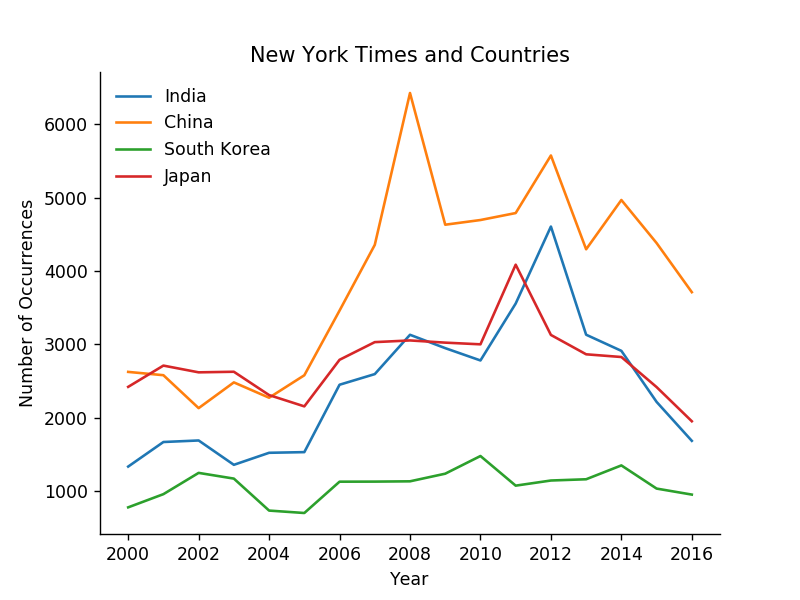

# Countries-in-NY-Times
The given visual addresses the question of how much attention did the countries like China, India, Japan and South Korea receive from New York Times. Data.world helped to provide the required data-set with occurrences in NY Times of all the countries. Data of 17 years (2000 to 2016) was considered for the analysis. The occurrences are counted on the basis of how many time an article in the New York Times has mentioned a specific country name. This data can help understand how a country has performed over the years that it came into attention of a popular news media.

Countries China and India both have a similar trend with the occurrences slightly decreases at first, then increase by a good amount and then again decrease. However, China's final decrease stopped at around 4000 which is 1000 more than from the start whereas for India it almost plummeted to it initial value. Japan reached its peak in 2011 with approximately 4000 occurrences and lowest in 2016 with 2100 occurrences which is similar to its initial value. South Korea remains at the bottom throughout the 17 year period. At around 400 occurrences South Korea has the lowest count and with more than 6000 count China has the highest count record from 2000 to 2016.

